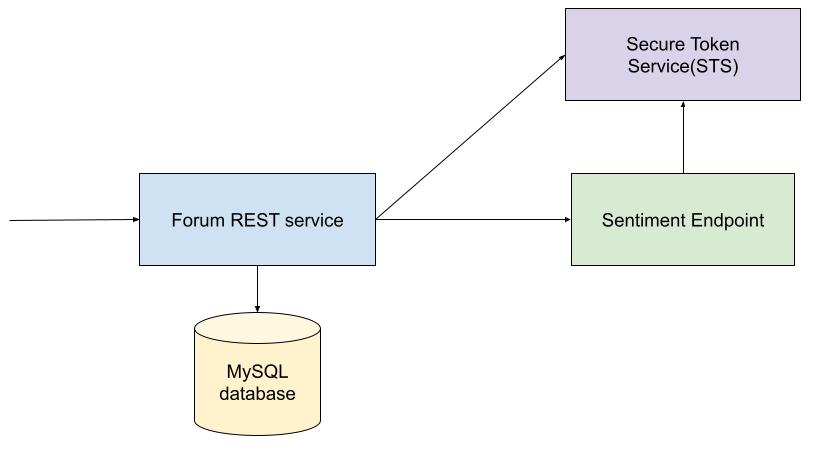
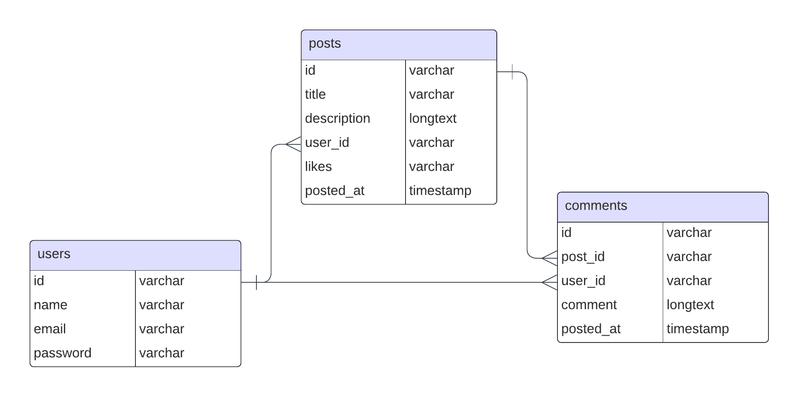

# Integration Basics with Ballerina

## Training Objective

Cover basic concepts related to integration. Following sessions will cover different topics deeply.

## Areas Covered

- Installing and Managing distributions
- Writing a simple RESTful service
- Accessing database
- Data transformation with data mapper
- Code to Cloud
- HTTP client
- Resiliency
- Service/Client security with SSL/MTLS
- Security - OAuth2

## Prerequisites

- Install the latest version of Ballerina
- Set up VS code by installing the Ballerina extension
- Install Docker

## Scenario

The scenario is based on a simple API written for a forum site, which has users, associated posts and comments. Following depicts the high level component diagram:



The forum REST service exposes the following resources:

| Resource | Description |
| -------- | ----------- |
| `POST api/users` | Create a new user |
| `POST api/login` | Login as with user credentials |
| `POST api/users/{id}/posts` | Create a new forum post |
| `GET api/posts` | Get all the forum posts |
| `GET api/posts/{id}` | Get the forum post specified by the id |
| `POST api/posts/{id}/like` | Like a forum post |
| `POST api/posts/{id}/comments` | Comment on a post |

Following is the entity relationship diagram:



## Task 3 - Verify the post content with the sentiment analysis service

The mock sentiment analysis service written in Ballerina is available in the `backend/sentiment-api` directory. The service exposes a single resource, which accepts a string and returns a sentiment score.

- Port: `9000`

- Path: `/text-processing/api/sentiment`

- Method: `POST`

- Request body:

  ```json
  {
    "text": "This is a sample text"
  }
  ```

- Success response - `200 OK`:

  ```json
  {
    "probability": { 
      "neg": 0.30135019761690551, 
      "neutral": 0.27119050546800266, 
      "pos": 0.69864980238309449
    }, 
    "label": "pos"
  }
  ```

The label can be one of the following values:

- `pos` - Positive sentiment
- `neg` - Negative sentiment
- `neutral` - Neutral sentiment

Pass the post description to the sentiment analysis service and verify the sentiment score. If the label is `pos`, then the post is valid. Otherwise, the post is forbidden.

- Rejected response - `403 FORBIDDEN`:

  ```json
  {
    "error_message": "Post contains negative sentiment"
  }
  ```

### Subtasks

- **Task 3.1** - Connect to the sentiment analysis service without SSL
- **Task 3.2** - Secure the sentiment analysis service with SSL and connect to it
- **Task 3.3** - Secure the sentiment analysis service with mutual SSL and connect to it
- **Task 3.4** - Secure the sentiment analysis service with OAuth2 and connect to it
